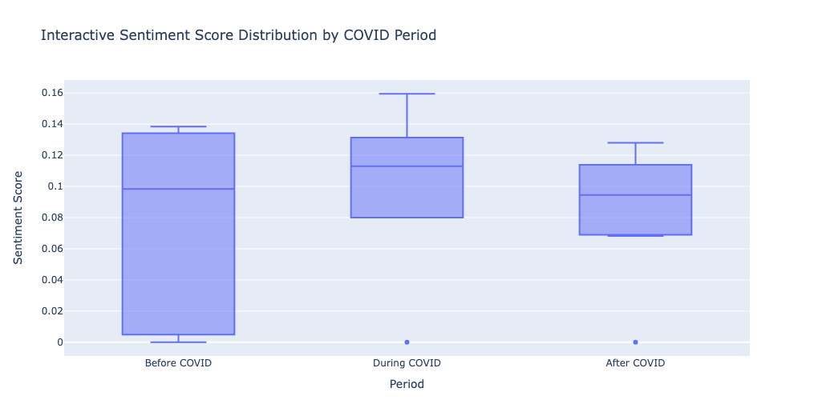

# Sentiment Analysis of Live Coding in Computer Science Education over COVID-19 pandemic

## Project Overview

This project aims to analyze the sentiment towards the live coding approach in Computer Science education during the Covid-19 pandemic using Natural Language Processing (NLP) techniques. A comprehensive framework was developed to extract and assess sentiments from research papers, providing insights into the effectiveness and perception of live coding as a teaching methodology.

## Features

- **Sentiment Analysis Framework:** Leverages NLP to analyze sentiments in research papers related to live coding.
- **Statistical Significance Testing:** Utilizes ANOVA and Kruskal-Wallis Test to determine the significance of sentiment scores.
- **Comprehensive Data Processing:** Handles text data extraction, sentiment analysis, and statistical evaluation.

## Technologies Used

- **Python**
- **Natural Language Processing (NLP)**
- **ANOVA**
- **Kruskal-Wallis Test**
- **Pandas**
- **NLTK**
- **Plotly**

## Dataset used

For this project, I created my own dataset. I compiled 22 research papers from Google Scolar within a specific time range and divided them into 3 folders(before_covid - Dec 2017 to Mar 2020, during_covid -  Mar 2020 to Dec 2021, after_covid - Dec 2021 to Mar 2024). A zip file of these research papers is used as dataset for this project.

## Getting Started

### Prerequisites

Ensure you have the following installed:
- Python 3.7 or higher
- Jupyter Notebook

### Usage

1. Clone the repository
2. Modify the zip file as per your need.
3. Execute Jupyter notebook.

## Results
The analysis provides insights into the sentiment trends towards live coding in Computer Science education during the pandemic. Statistical significance testing confirms the reliability of these sentiments across different studies. Our results displayed that there is small increase of positive sentiment towards live coding in during and after COVID-19 pandemic than before pandemic. 

## License
This project is licensed under the terms of the [MIT License](./LICENSE).

## Future Scope
- Incorporate wide range of period to get more research papers and articles. 
- Modify search prompts on Google Scolars
- Further statistical analysis using various different techniques.

## Conclusion

From our statistical analysis, we can say that sentiment scores have increased little bit over COVID-19 period but not significantly.
The visualizations further substantiate this stability, showing consistent sentiment distributions before, during, and after the pandemic. This suggests that the academic perception of live coding as an educational tool remained resilient despite the disruptions caused by COVID-19.